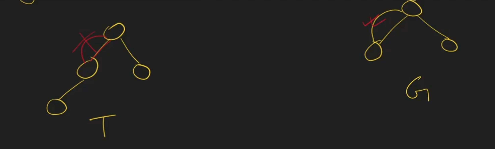

# 1_1 What is Graph
## Graph vs Tree
- Graph has multiple edges vs Tree does not have multiple edges.
  
- Graph has multiple way to travel from one node to another node vs Tree has only one way.
  
- Graph can have cycle vs Tree never can have a cycle.
  
- In Graph We can go from child to parent vs In Tree we can not do this.
  
- Tree is a part of a Graph
  

## 📘 Definitions
### Tree
A tree is a hierarchical data structure consisting of nodes connected by edges, where there is exactly **one root node**, and every other node has exactly **one parent**.
✅ Trees are a **special** type of **graph**.

### Graph
A graph is a more **generalized** data structure consisting of vertices (nodes) and edges.
Graphs can be **directed or undirected**, **cyclic or acyclic**, and may have **multiple connections between nodes**.

## 📊 Comparison Table: Tree vs Graph
| Feature              | Tree                                                                 | Graph                                                               |
|----------------------|----------------------------------------------------------------------|---------------------------------------------------------------------|
| **Definition**       | A hierarchical structure with a root node and parent-child relations | A collection of vertices and edges, no strict hierarchy             |
| **Hierarchy**        | Strict parent-child relationship                                     | No strict hierarchy                                                 |
| **Cycles**           | Cannot have cycles (**Acyclic**)                                     | Can have cycles or be acyclic                                       |
| **Connectedness**    | Always connected                                                     | Can be connected or disconnected                                    |
| **Edges**            | If there are **n** nodes, then exactly **n-1** edges                 | Number of edges varies, can be more than or less than **n-1**       |
| **Root Node**        | Always has a single root                                             | No concept of root                                                  |
| **Path Between Nodes** | Exactly one unique path between any two nodes                      | Multiple paths may exist between two nodes                          |
| **Applications**     | File system, hierarchy, parsing expressions                         | Social networks, maps, recommendation systems, web link structures  |

## 🖼️ Visual Diagram
### Tree
        A
       / \
      B   C
     / \
    D   E

### Graph
   A ---- B
   | \    |
   |  \   |
   C ---- D

## ✅ Key Takeaways
- A **Tree** is a **special type of Graph** (connected, acyclic, hierarchical).
- A **Graph** is more **flexible**, supporting cycles, multiple edges, and different structures.
- Trees are **best for hierarchy and structured data**, while Graphs are best for complex relationships.