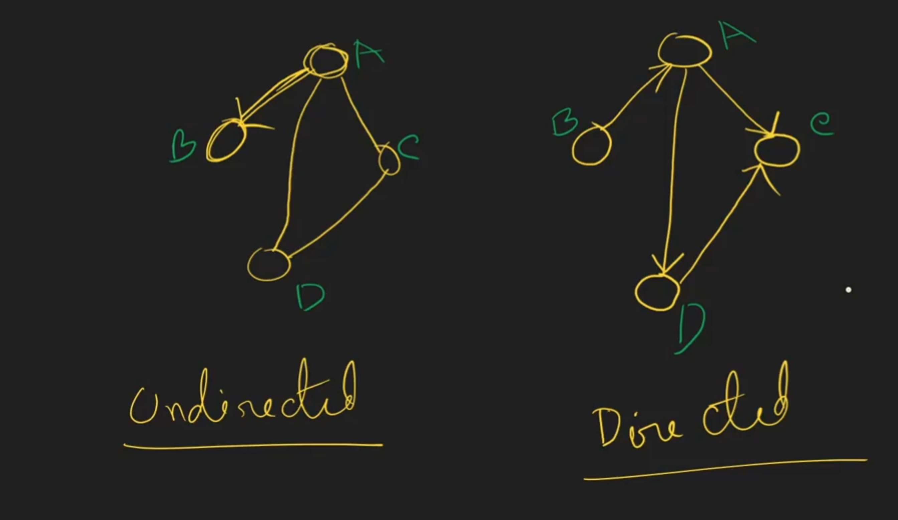

# 1_2 Types of Graph
- Direction
  1. Directed
  2. Undirected
- weight
  1. Weighted
  2. Unweighted
- Cycle
  1. Cyclic
  2. Acyclic

## Directed and Undirected

## Weighted and Unweighted

## Cyclic(has cycle) and Acyclic(don't have cycle)

