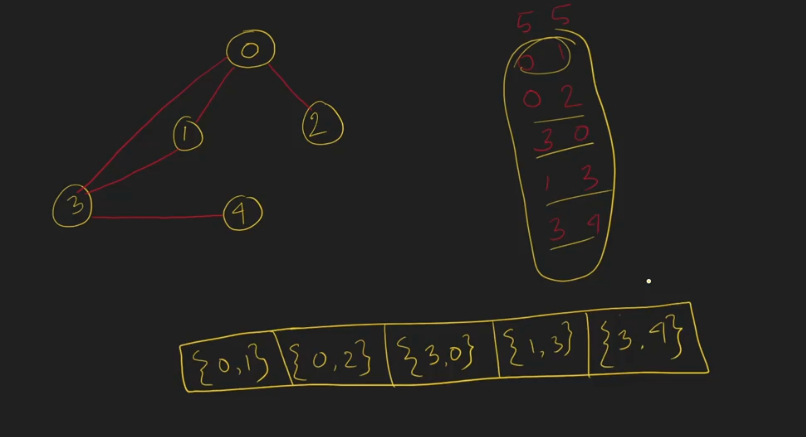

# 2_3 Edge List

```c++
#include<bits/stdc++.h>
using namespace std;
int main()
{
    int n, e;
    cin >> n >> e;
    vector<pair<int, int>> edge_list;
    
    while(e--){
        int a, b;
        cin >> a >> b;
        edge_list.push_back({a, b});
    }

    for(pair<int, int> p : edge_list){
        cout << p.first << " " << p.second << endl;
    }

    return 0;
}
```
```bash
//input
5 5
0 1
0 2
3 0
1 3
3 4

//output
0 1
0 2
3 0
1 3
3 4
```