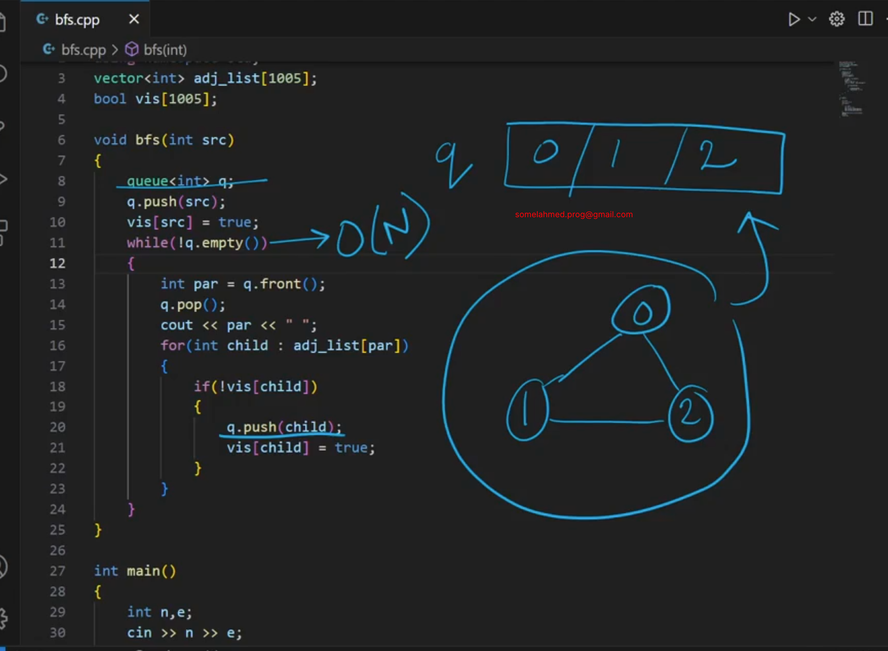

# 2_8 Complexity Analysis of BFS
```c++
#include<bits/stdc++.h>
using namespace std;
vector<int> adj_list[1000];
bool vis[1005];

void bfs(int src){
    queue<int> q;
    q.push(src);
    vis[src] = true;
    while(!q.empty()){
        int parent = q.front();
        q.pop();
        cout << parent << " ";
        for(int val : adj_list[parent]){
            if(vis[val] == false){
                q.push(val);
                vis[val] = true;
            }else continue;
        }
    }
}

int main()
{
    int n, e;
    cin >> n >> e;

    while (e--)
    {
        /* code */
        int a, b;
        cin >> a >> b;
        adj_list[a].push_back(b);
        adj_list[b].push_back(a);
    }

    memset(vis, false, sizeof(vis));
    bfs(0);
    
    return 0;
}
```



Inner loop always run based on Edge, although N(Node) increase(outer loop). Inner loop does not depend on outer loop. So, the final Time Complexity is not O(N*E), it is O(N+E) or O(V+E), sometimes node is also called vertex.