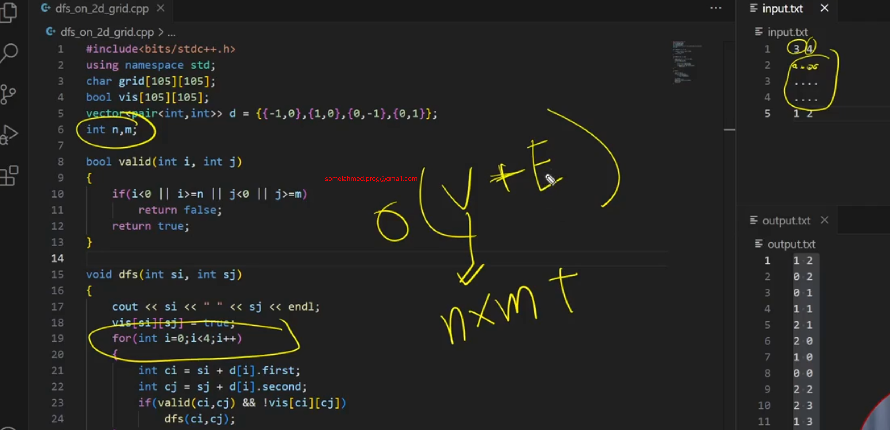

# 3_5 DFS on 2D grid Implementation
```c++
#include<bits/stdc++.h>
using namespace std;

int n, m;

char grid[105][105];
bool vis[105][105];

vector<pair<int, int>> d = {{-1, 0}, {1, 0}, {0, -1}, {0, 1}};

bool valid(int i, int j){
    if(i < 0 || i >= n || j < 0 || j >= m)
        return false;
    return true;
}

void dfs(int si, int sj){
    cout << si << " " << sj << endl;
    vis[si][sj] = true;

    for(int i = 0; i < 4; i++){
        int ci = si + d[i].first;
        int cj = sj + d[i].second;
        if(valid(ci, cj) && !vis[ci][cj]){
            dfs(ci, cj);
        }
    }
}

int main()
{
    cin >> n >> m;

    for(int i = 0; i < n; i++){
        for(int j = 0; j < m; j++){
            cin >> grid[i][j];
        }
    }

    int si, sj;
    cin >> si >> sj;
    memset(vis, false, sizeof(vis));
    dfs(si, sj);
    return 0;
}
```

Here, Edge, E is constant. So Time Complexity is O(N*M), Here N is row and M is column.