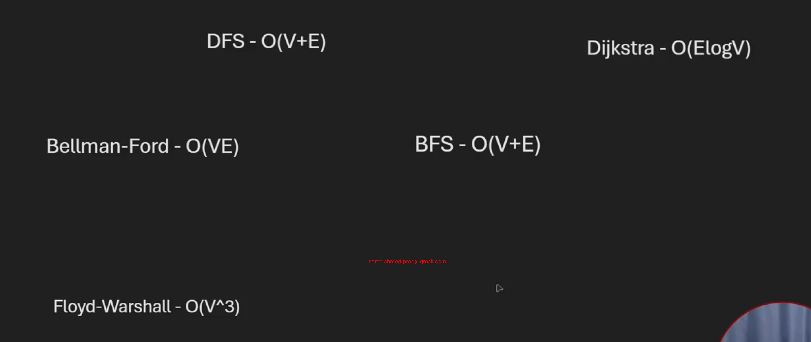

# 10_5 DFS vs BFS vs Dijkstra vs Bellman-Ford vs Floyd-warshall

- if we only want to traverse graph then use -> **DFS(O(V+E))**/ **BFS(O(V+E))** -> but DFS is easy, so we will use DFS
- for finding shortest path -> **BFS**/**Dijkstra**/**Bellman-Ford**/**Floyd-warshall**
  - if source is fixed then -> **BFS**/**Dijkstra**/**Bellman-Ford**
    - if weighted graph then we can not use **BFS**
    - if there is negative weighted cycle(means there is both cycle and negative weight if only one then there is no problem) then we can not use **Dijkstra**
  - if source is not fixed, change everytime or there is query -> **Floyd-warshall**